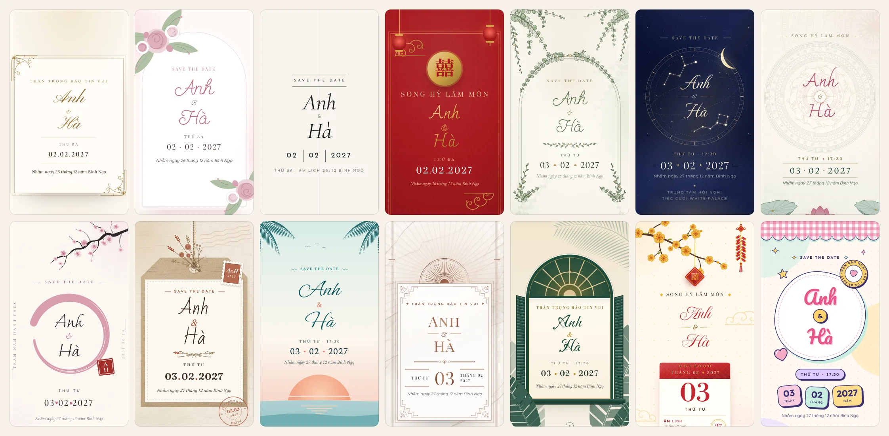
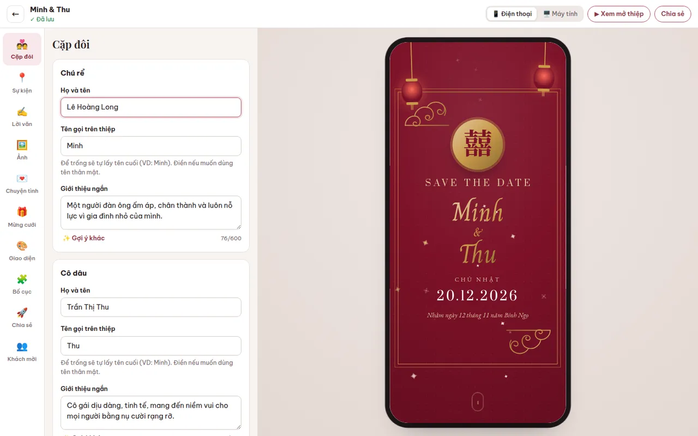
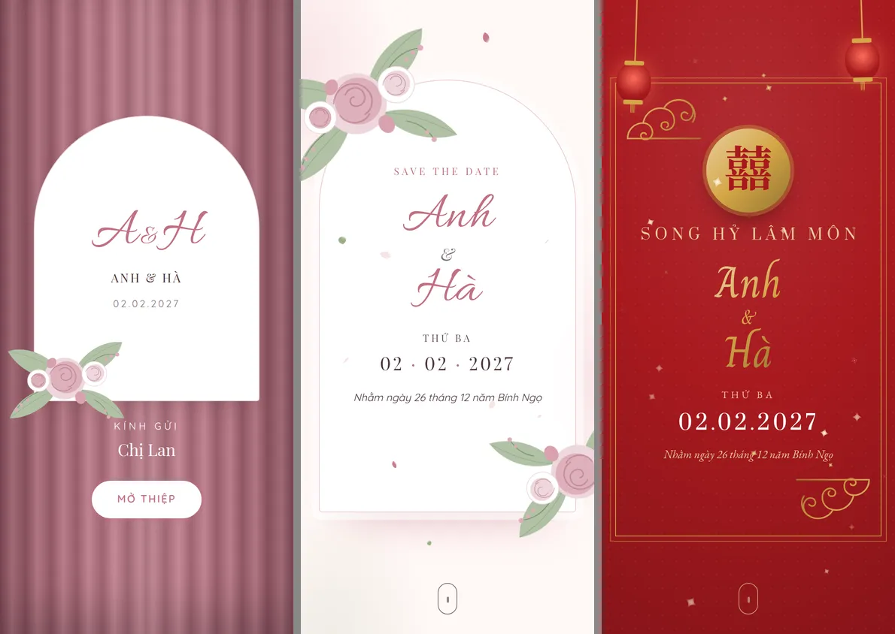
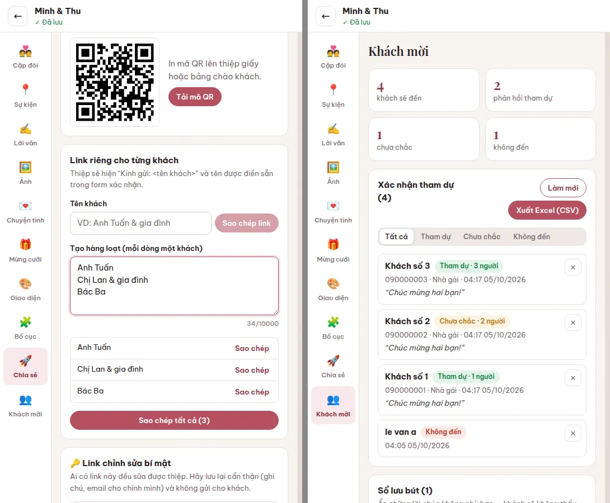

# 💍 Wedding Studio — Nền tảng thiệp cưới online

Website để **tạo & quản lý thiệp cưới online**: khách chọn một mẫu, điền **tên cô dâu – chú rể**
(và ngày cưới nếu có) → hệ thống tự viết lời mời, tính **ngày âm lịch**, tạo đếm ngược, bản đồ,
form xác nhận tham dự, hộp mừng cưới **VietQR**, hiệu ứng mở thiệp… Người dùng chỉnh sửa tiếp trong
studio có **xem trước trực tiếp**, rồi gửi link (mỗi khách một link riêng có “Kính gửi: …”).

Toàn bộ chạy bằng **Docker** (1 container + 1 volume dữ liệu), không cần dịch vụ bên ngoài.



| Studio chỉnh sửa (xem trước trực tiếp) | Mở thiệp trên điện thoại |
|---|---|
|  |  |

---

## Mục lục
1. [Tính năng](#1-tính-năng)
2. [Chạy nhanh bằng Docker](#2-chạy-nhanh-bằng-docker)
3. [Phát triển không dùng Docker](#3-phát-triển-không-dùng-docker)
4. [Cấu hình `.env`](#4-cấu-hình-env)
5. [Kiến trúc](#5-kiến-trúc)
6. [Tạo mẫu thiệp mới (thư mục `templates/`)](#6-tạo-mẫu-thiệp-mới)
7. [Các tình huống đã xử lý](#7-các-tình-huống-đã-được-xử-lý)
8. [Kiểm thử](#8-kiểm-thử)
9. [Vận hành production](#9-vận-hành-production)
10. [Góc kinh doanh](#10-góc-kinh-doanh)
11. [Lộ trình mở rộng](#11-lộ-trình-mở-rộng)

---

## 1. Tính năng

**Cho người làm thiệp (cô dâu chú rể / khách hàng của bạn)**
- Tạo thiệp trong ~1 phút: chọn mẫu → nhập tên → xong. Tên được chuẩn hoá (`nguyễn  văn MINH` → `Nguyễn Văn Minh`).
- **Tự viết nội dung** với 4 giọng văn (trang trọng, lãng mạn, hiện đại, truyền thống): tiêu đề, lời mời, trích dẫn, giới thiệu cặp đôi, câu chuyện tình yêu, lời cảm ơn, hashtag… Nút **✨ Gợi ý khác** cho từng mục.
- **Lịch âm tự động** (“Nhằm ngày 12 tháng 11 năm Bính Ngọ”) theo thuật toán chuẩn cho múi giờ Việt Nam, có tháng nhuận.
- 13 phần bật/tắt & sắp xếp được: ảnh bìa, trích dẫn, thư mời & gia đình hai bên, cô dâu chú rể, lịch tháng, đếm ngược, sự kiện (Ăn hỏi / Vu quy / Thành hôn / Tiệc cưới) + bản đồ + lưu vào lịch, chuyện tình yêu, album, xác nhận tham dự, sổ lưu bút, hộp mừng cưới, lời cảm ơn.
- **14 mẫu thiệp** có sẵn (sang trọng, hoa pastel, tối giản, Song Hỷ, vườn xanh, đêm sao, sen Việt, anh đào, mộc mạc, biển, cẩm thạch, Đông Dương, xuân Tết, kẹo ngọt) — mỗi mẫu có 3–4 bảng màu phối sẵn.
- Tuỳ biến: đổi mẫu bất kỳ lúc nào (giữ nguyên nội dung), bảng màu gợi ý / màu tự chọn, **70 font hỗ trợ đủ dấu tiếng Việt** (xem trước ngay trong ô chọn) + 12 cặp font phối sẵn, nhạc nền.
- **Hiệu ứng** (xem mục [Hiệu ứng](#hiệu-ứng-có-sẵn)): 16 hiệu ứng nền chồng được 2 lớp, 8 kiểu mở thiệp, pháo hoa/pháo giấy khi mở, hiệu ứng khi chạm, 6 kiểu chữ tên cô dâu chú rể (viết tay, từng chữ, ánh kim…), cuộn trang có chuyển động & hoạ tiết tự vẽ nét.
- Studio: **xem trước trực tiếp** điện thoại/máy tính, **tự lưu**, cảnh báo khi 2 tab cùng sửa, tự thử lại khi mất mạng, tải ảnh có nén sẵn trên trình duyệt.
- Chia sẻ: link đẹp `/w/minh-ha`, **link riêng từng khách** (tạo hàng loạt, dán vào Excel), mã QR in thiệp giấy, xem trước đẹp khi gửi qua Zalo/Messenger.
- Quản lý khách: thống kê RSVP, lọc, **xuất Excel (CSV UTF-8)**, ẩn/xoá lời chúc.

**Cho khách mời**
- Thiệp mở mượt trên điện thoại đời cũ, hiệu ứng canvas nhẹ, tự dừng khi chuyển tab.
- Xác nhận tham dự, gửi lời chúc, quét **VietQR** mừng cưới (sinh offline, mọi ngân hàng), sao chép số tài khoản, chỉ đường Google Maps, lưu sự kiện vào lịch (.ics / Google Calendar).
- Vẫn đọc được đầy đủ khi tắt JavaScript; tôn trọng chế độ “giảm chuyển động”.

**Cho bạn (quản trị)**
- Trang `/admin`: thống kê, tìm kiếm thiệp, công bố/khoá thiệp, **cấp lại link chỉnh sửa** khi khách làm mất, xoá thiệp, xem/tải lại mẫu thiệp.
- Chế độ `ALLOW_PUBLIC_CREATE=false`: chỉ bạn tạo thiệp (mô hình dịch vụ làm thiệp cho khách).



---

## 2. Chạy nhanh bằng Docker

Yêu cầu: Docker + Docker Compose v2.

```bash
git clone <repo> wedding && cd wedding
make up            # tạo .env (khoá ngẫu nhiên) + build + chạy
# hoặc thủ công:
cp .env.example .env    # sửa ADMIN_PASSWORD, BASE_URL, SESSION_SECRET
docker compose up -d --build
```

Mở:
- http://localhost:3000 — trang chủ & bộ sưu tập mẫu
- http://localhost:3000/new — tạo thiệp
- http://localhost:3000/admin — quản trị (mật khẩu `ADMIN_PASSWORD`)

Lệnh hữu ích (`make help` để xem tất cả):

| Lệnh | Việc |
|---|---|
| `make logs` | Xem log |
| `make test` | Chạy toàn bộ test **bên trong Docker** |
| `make backup` | Sao lưu DB + ảnh ra `./backups/*.tgz` |
| `make restart` | Khởi động lại (VD: sau khi thêm mẫu) |
| `make up-https` | Chạy kèm Caddy, tự cấp HTTPS (cần `DOMAIN` trong `.env`) |
| `make down` | Dừng (dữ liệu vẫn còn trong volume) |

> Build trong mạng công ty có proxy chặn TLS? `docker build --secret id=extra_ca,src=/path/proxy-ca.crt .`

---

## 3. Phát triển không dùng Docker

Yêu cầu Node.js ≥ 22.

```bash
npm install
npm run build        # build studio (Vite → dist/studio)
npm run dev          # server tự reload + studio build --watch → http://localhost:3000
npm test             # 84 test unit + tích hợp (~2 giây)
npm run test:e2e     # test trên trình duyệt thật (cần Chromium, đặt CHROMIUM_PATH nếu cần)
```

Ở chế độ dev, mẫu thiệp được nạp lại tự động mỗi lần tải trang.

---

## 4. Cấu hình `.env`

| Biến | Mặc định | Ý nghĩa |
|---|---|---|
| `BASE_URL` | `http://localhost:3000` | URL công khai — dùng cho link chia sẻ, ảnh xem trước Zalo/Facebook |
| `HOST_PORT` | `3000` | Cổng trên máy chủ (docker compose) |
| `ADMIN_PASSWORD` | *(trống = tắt admin)* | Mật khẩu `/admin` |
| `SESSION_SECRET` | *(tự sinh tạm)* | Khoá ký phiên admin, ≥ 32 ký tự (`openssl rand -hex 32`) |
| `BRAND_NAME` | `Thiệp Cưới Online` | Tên thương hiệu ở trang chủ & chân thiệp (để trống để ẩn chân thiệp) |
| `ALLOW_PUBLIC_CREATE` | `true` | `false` = chỉ admin tạo thiệp |
| `TRUST_PROXY` | `false` | `true` khi chạy sau Caddy/Nginx/Cloudflare |
| `WEDDING_TZ_OFFSET` | `+07:00` | Múi giờ giờ cưới (đếm ngược, lịch .ics) |
| `MAX_IMAGE_MB` / `MAX_AUDIO_MB` | `12` / `15` | Giới hạn dung lượng tải lên |
| `MAX_IMAGES_PER_INVITATION` | `60` | Số ảnh tối đa mỗi thiệp |
| `ASSET_GC_GRACE_HOURS` | `24` | Xoá file không còn dùng sau N giờ |
| `TEMPLATE_HOT_RELOAD` | `true` ở dev | Nạp lại mẫu mỗi request |
| `LOG_LEVEL` | `info` | `debug` · `info` · `warn` · `error` |
| `DOMAIN` | — | Tên miền cho profile `https` (Caddy) |

---

## 5. Kiến trúc

```
Trình duyệt ──► Fastify (Node 22) ─┬─► Nunjucks render thiệp (SSR, CSP chặt, nén Brotli)
                                   ├─► API JSON (zod validate) ──► SQLite (WAL) /data/wedding.db
                                   ├─► Upload ──► sharp (xoay EXIF, xoá GPS, WebP) ──► /data/uploads
                                   └─► Studio SPA (Preact + Vite, 38KB gzip)
```

| Lớp | Công nghệ | Lý do chọn |
|---|---|---|
| Server | **Fastify 5** | Nhanh, có sẵn helmet / rate-limit / multipart / nén |
| Dữ liệu | **SQLite** (better-sqlite3, WAL) | 1 file, sao lưu dễ, đủ cho hàng chục nghìn thiệp trên 1 VPS nhỏ |
| Template | **Nunjucks** | Cú pháp giống Jinja2, tự escape chống XSS, kế thừa/ghi đè dễ |
| Validate | **zod** | Một schema duy nhất cho dữ liệu thiệp, thông báo lỗi tiếng Việt |
| Ảnh | **sharp** | Resize/nén WebP, chống “bom giải nén”, xoá metadata |
| Studio | **Preact + Vite** | Nhẹ như React, build ra file tĩnh |
| Thiệp (phía khách) | **Vanilla JS** (~7KB gzip) | Không framework → mở nhanh trên 3G/4G |

```
server/
├── index.js            # entry: khởi động, graceful shutdown (SIGTERM)
├── app.js              # dựng Fastify app (dùng chung cho test)
├── config.js           # đọc biến môi trường
├── db.js / repo.js     # migration SQLite + truy vấn
├── lib/                # lunar.js (âm lịch), vietqr.js, content-generator.js, schema.js, media.js, csp.js…
├── services/           # nghiệp vụ: invitations.js, assets.js (upload + dọn rác)
├── templates/          # registry.js (quét thư mục mẫu), view-model.js, demo.js
└── routes/             # pages, api-invitations, api-public (RSVP/lời chúc), api-admin
studio/                 # giao diện chỉnh sửa (Preact): pages/, panels/, components/
templates/              # mẫu thiệp (xem mục 6)
views/ + public/        # trang chủ, trang lỗi
scripts/                # template:new, template:validate, template:preview, template:shot, backup
tests/                  # node:test + e2e Playwright
```

**Luồng dữ liệu một thiệp**: dữ liệu thiệp là **một tài liệu JSON** (tên, sự kiện, nội dung, ảnh, theme…)
lưu trong SQLite; *mẫu thiệp chỉ quyết định cách hiển thị*. Vì vậy đổi mẫu không mất nội dung.

**Quyền chỉnh sửa không cần tài khoản**: khi tạo thiệp, người dùng nhận *link chỉnh sửa bí mật*
`/edit/<id>#token=<…>`. Token nằm sau dấu `#` nên không bao giờ gửi lên server qua URL/log; server chỉ
lưu **hash SHA-256** của token. Admin có thể cấp lại link nếu bị mất.

---

## 6. Tạo mẫu thiệp mới

Mẫu gốc nằm ở **[`templates/_starter/`](templates/_starter/README.md)** — có chú thích từng dòng, bảng tra
biến, CSS variables và checklist trước khi publish.

```bash
npm run template:new -- vuon-xanh --name "Vườn Xanh"   # sinh từ _starter
npm run template:new -- hong-do --from traditional-red  # hoặc nhân bản 1 mẫu có sẵn
npm run template:validate                               # kiểm tra manifest + render thử
npm run template:preview vuon-xanh                      # chụp ảnh preview.webp
```

Một mẫu tối thiểu chỉ gồm `template.json` + `index.njk` + `style.css`. Mẫu có thể **ghi đè** bất kỳ
section nào bằng cách tạo file cùng tên (VD `sections/hero.njk`) — xem `floral-blush/` và `traditional-red/`.

Khi thiết kế, dùng `template:shot` để chụp mọi trạng thái (màn mở thiệp, lúc mở, ảnh bìa, desktop, toàn trang)
và kiểm tra lỗi console / tràn ngang ở 320px & 390px:

```bash
NODE_USE_ENV_PROXY=1 npm run template:shot -- vuon-xanh                       # ảnh nằm trong .shots/vuon-xanh/
npm run template:shot -- vuon-xanh --query "intro=doors&effect=sakura"        # thử biến thể
```

### Hiệu ứng có sẵn

| Nhóm | Lựa chọn | Trường trong `theme` |
|---|---|---|
| Hiệu ứng nền (chồng 2 lớp) | cánh hoa, anh đào, hoa mai, lá bay, tim, lấp lánh, bụi vàng, đom đóm, bokeh, bướm, sao, đèn trời, bong bóng, bóng bay, tuyết, pháo giấy | `effect`, `effect2`, `effectIntensity` (low/medium/high) |
| Mở thiệp | phong bì, kéo rèm, cánh cửa, thiệp gập, cuộn thư, vòng tròn, hiện dần, không | `intro` |
| Khi mở thiệp | pháo hoa, pháo giấy, tim, cánh hoa | `burst` |
| Khi chạm màn hình | tim, lấp lánh, gợn sóng | `tap` |
| Tên cô dâu chú rể | hiện dần, viết tay, từng chữ, ánh kim, phát sáng, bồng bềnh | `nameAnimation` |
| Khi cuộn trang (trong mẫu) | `data-reveal="up\|rise\|blur\|flip\|drop\|zoom…"`, `data-stagger`, `<svg data-draw>`, `data-parallax` | — |

Màu hạt hiệu ứng tự lấy theo bảng màu của thiệp; màu quá tối/nhạt/xám tự đổi sang màu tự nhiên của hiệu ứng.
Trang demo nhận tham số để thử nhanh mà không cần tạo thiệp, VD
`/templates/classic-gold?effect=sakura&effect2=butterflies&intro=doors&burst=fireworks&name=handwrite`
(các khoá: `effect, effect2, intro, burst, tap, name, heading, body, script` — giá trị sai bị bỏ qua).

Trên Docker, thư mục `templates/` được mount vào container: thêm/sửa mẫu rồi bấm **Admin → Tải lại mẫu**,
không cần build lại image. Nếu một mẫu bị lỗi, nó bị bỏ qua (kèm thông báo trong Admin) chứ không làm sập site;
thiệp đang dùng mẫu bị xoá sẽ tự hiển thị bằng mẫu khác.

---

## 7. Các tình huống đã được xử lý

**Dữ liệu & nội dung**
- Tên có dấu gõ từ macOS/iOS (Unicode NFD) được chuẩn hoá NFC; tên rất dài tự xuống dòng; tên 1 chữ vẫn chạy.
- Ngày không tồn tại (30/02), giờ sai định dạng, màu sai, font ngoài danh sách, link `javascript:` → bị từ chối với thông báo chỉ rõ trường lỗi.
- Phần chưa có nội dung (chưa có ảnh, chưa có câu chuyện, chưa có tài khoản ngân hàng…) **tự ẩn**.
- Hạn RSVP không bao giờ đặt vào quá khứ; đếm ngược tự đổi thành lời chúc khi đã qua ngày cưới; múi giờ chuẩn cho khách ở nước ngoài.
- Không cho công bố khi thiếu thông tin tối thiểu (tên, ngày, sự kiện, địa điểm) — hiển thị checklist cần bổ sung.

**Chỉnh sửa**
- Hai tab/thiết bị cùng sửa → phát hiện xung đột phiên bản (HTTP 409), không ghi đè mất dữ liệu.
- Mất mạng khi đang lưu → tự thử lại (2s, 4s, 8s… tối đa 30s); cảnh báo khi đóng tab lúc chưa lưu.
- Đổi đường dẫn thiệp → **link cũ vẫn tự chuyển** sang link mới (301), không làm hỏng link đã gửi khách.
- Xem trước dùng 2 iframe luân phiên (double-buffer) → không chớp trắng khi gõ; giữ nguyên vị trí cuộn.

**Ảnh & file**
- Kiểm tra định dạng bằng *magic bytes* (không tin đuôi file / MIME); file giả mạo (PHP, SVG) bị chặn.
- Tự xoay theo EXIF, **xoá vị trí GPS**, resize ≤ 2000px, WebP + thumbnail; chống ảnh “bom giải nén”.
- Ảnh HEIC trên iPhone được trình duyệt chuyển sang JPEG trước khi tải; nếu không được sẽ có hướng dẫn rõ ràng.
- File không còn dùng được tự dọn sau 24h (vẫn kịp “hoàn tác”).

**Khách mời**
- Cùng một khách gửi RSVP nhiều lần → cập nhật bản ghi cũ (so khớp tên không dấu + SĐT), không nhân đôi.
- Chống spam: honeypot ẩn + giới hạn 8 lần/phút/IP; trường hợp vượt giới hạn có thông báo tiếng Việt.
- Xuất CSV có BOM để Excel hiển thị đúng tiếng Việt; chặn **CSV formula injection** (`=HYPERLINK…`).
- Form RSVP/lời chúc vẫn gửi được khi trình duyệt tắt JavaScript.

**Bảo mật**
- Mọi nội dung người dùng đều được escape (đã test XSS trên mọi mẫu); JSON nhúng trong trang được escape chống `</script>`.
- CSP chặt trên trang thiệp (không script bên thứ ba), `frame-ancestors 'none'`, chống clickjacking; HSTS khi chạy HTTPS.
- Phiên admin ký HMAC, cookie `HttpOnly` + `SameSite=Strict`; đăng nhập giới hạn 5 lần/phút; so sánh chuỗi chống timing attack.
- Container chạy bằng user không phải root; `npm ci --ignore-scripts` khi build.

**Hiệu năng & trải nghiệm**
- Trang thiệp ~44KB HTML, nén Brotli còn ~7KB; JS phía khách ~7KB gzip, không framework.
- Hiệu ứng canvas: dùng sprite dựng sẵn, giới hạn DPR, số hạt theo kích thước màn hình, **tạm dừng khi ẩn tab**.
- Nhạc nền chỉ phát sau thao tác “Mở thiệp” (đúng chính sách autoplay của iOS/Android), tự dừng khi chuyển tab.
- Không tràn ngang trên điện thoại (đã kiểm tra tự động ở 320px và 390px), bản đồ chỉ tải khi bấm (tiết kiệm ~1MB).

---

## 8. Kiểm thử

| Lệnh | Phạm vi |
|---|---|
| `npm test` | **110 test**: lịch âm (Tết các năm, tháng nhuận, 1985), VietQR CRC, chuẩn hoá tiếng Việt, schema, bộ sinh nội dung, render + XSS trên mọi mẫu, danh mục font/hiệu ứng, tham số demo, toàn bộ API (token, 409, publish, RSVP, upload, GC, slug redirect, admin, rate limit) |
| `npm run template:validate` | Manifest, file thiếu, render thử mọi mẫu với dữ liệu đầy đủ & gần rỗng |
| `npm run test:e2e` | Trình duyệt thật: mở thiệp + lightbox + đếm ngược trên mobile & desktop cho từng mẫu, khách gửi RSVP, luồng tạo → sửa → tự lưu → công bố, chế độ không JavaScript |
| `make test` | Chạy test bên trong Docker |

CI (`.github/workflows/ci.yml`) chạy toàn bộ khi push/PR, kèm build và smoke test container.

---

## 9. Vận hành production

**HTTPS tự động**: trỏ DNS tên miền về máy chủ, đặt trong `.env`:
```env
DOMAIN=thiepcuoi.example.com
BASE_URL=https://thiepcuoi.example.com
TRUST_PROXY=true
```
rồi `make up-https` — Caddy tự xin & gia hạn chứng chỉ Let's Encrypt.

**Sao lưu / khôi phục**: toàn bộ dữ liệu nằm trong volume `wedding-data` (`/data`: `wedding.db` + `uploads/`).
`make backup` tạo bản sao lưu nhất quán (dùng SQLite online backup, không cần dừng app). Xem `make restore-hint`.
Nên đặt cron chạy `make backup` hằng ngày và đồng bộ thư mục `backups/` lên object storage.

**Cập nhật phiên bản**: `git pull && docker compose up -d --build` — migration database chạy tự động khi khởi động.

**Giám sát**: `GET /healthz` (Docker healthcheck đã cấu hình sẵn), log JSON (pino) phù hợp đẩy vào Loki/ELK/CloudWatch.

**Quy mô** (đo thực tế bằng autocannon trên container, 1 tiến trình Node): trang thiệp đạt **~550 request/giây**,
độ trễ trung vị 85ms với 50 kết nối đồng thời, RAM ~210MB. Tức là 1 VPS 1 vCPU / 1GB RAM dư sức cho hàng
nghìn thiệp và hàng trăm nghìn lượt xem/ngày. Ảnh được cache vĩnh viễn (tên file bất biến) nên rất hợp đặt CDN phía trước.

---

## 10. Góc kinh doanh

Vài gợi ý thực tế nếu dùng nền tảng này để kinh doanh (dựa trên chính các tính năng đã có):

- **Freemium**: miễn phí kèm dòng “Thiệp cưới online bởi …” ở chân thiệp (`BRAND_NAME`) — mỗi thiệp gửi đi
  là một kênh quảng cáo tới 200–500 khách mời. Gói trả phí: bỏ dòng thương hiệu, nhạc nền, album lớn, tên miền đẹp.
- **Dịch vụ làm thiệp trọn gói** (`ALLOW_PUBLIC_CREATE=false`): bạn/nhân viên tạo thiệp cho khách hàng, gửi link
  chỉnh sửa cho cặp đôi tự hoàn thiện → chi phí vận hành thấp, dễ bán kèm studio ảnh, nhà hàng tiệc cưới.
- **Mẫu thiệp là “sản phẩm”**: thêm mẫu mới chỉ bằng 3 file (xem mục 6) → có thể thuê designer theo mùa cưới
  (mùa cưới chính ở Việt Nam: tháng 9 – tháng 1 âm lịch) và định giá mẫu cao cấp riêng.
- **Chi phí hạ tầng** gần như cố định: 1 VPS ~5–10 USD/tháng + tên miền. Với nền tảng cloud của bạn, khi tăng
  trưởng có thể tách ảnh sang object storage + CDN trước khi phải nghĩ tới scale ngang (xem mục 11).
- **Chỉ số nên theo dõi** (đã có số liệu trong `/admin`): số thiệp tạo/tuần, tỉ lệ *tạo → công bố*,
  lượt xem trung bình/thiệp, số RSVP/thiệp — đây là phễu chuyển đổi (funnel) của sản phẩm.

---

## 11. Lộ trình mở rộng

- Tài khoản người dùng (email/OTP, Zalo login) thay cho link chỉnh sửa bí mật; thanh toán (VNPay/MoMo) cho gói trả phí.
- Lưu ảnh lên S3/MinIO + CDN; Postgres khi cần chạy nhiều instance (lớp `repo.js` đã tách riêng để thay thế dễ).
- Tên miền riêng cho từng thiệp (Caddy on-demand TLS).
- AI viết lời mời/câu chuyện riêng theo lời kể của cặp đôi (có thể tích hợp Claude API thay cho bộ sinh luật hiện tại).
- Ảnh OG động (thẻ chia sẻ có tên khách), thống kê lượt mở theo từng khách, nhắc lịch qua Zalo OA/SMS.

---

Giấy phép: Apache-2.0 (xem `LICENSE`). Ảnh minh hoạ demo được vẽ bằng code (`scripts/generate-demo-assets.js`), không vướng bản quyền.
Nhạc nền do người dùng tự tải lên — hãy dùng bài hát bạn có quyền sử dụng.
